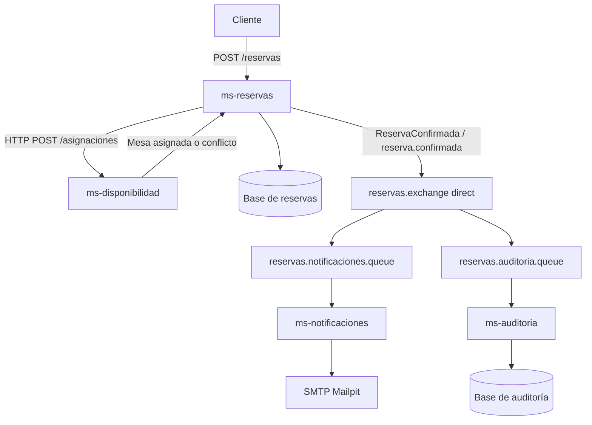

# Sistema de reservas de mesas con RabbitMQ

Sistema de reservas para un restaurante, implementado con Java y Spring Boot. Antes de confirmar una reserva, verifica y asigna una mesa mediante HTTP. Una vez confirmada, publica un evento en RabbitMQ para enviar el correo y registrar auditoría de forma independiente.

La documentación de la actividad está separada de esta guía:

- [Informe de diseño de la Parte 1](docs/INFORME_DISENO.md), elaborado por el equipo.
- [Informe de implementación de la Parte 2](docs/INFORME_IMPLEMENTACION.md), con resultados de las pruebas.
- [Guía para capturas de RabbitMQ](docs/CAPTURAS.md).

**Equipo:** Franco Garay, Deymon Gonzalez, Fernando Camus y Juan Carlos Tapia. **Sección:** 002D.

## Inicio rápido

Necesitas Docker Desktop iniciado y Docker Compose. Para levantar los servicios no necesitas instalar Java ni Maven: Docker compila el proyecto.

1. Clona el repositorio y entra a su carpeta:

```sh
git clone https://github.com/CloudNativeGrupo12/actividad-evaluada-rabbitmq.git
cd actividad-evaluada-rabbitmq
```

2. Desde esa carpeta, ejecuta:

```sh
docker compose up -d --build
docker compose ps
docker compose logs -f ms-reservas ms-notificaciones ms-auditoria
```

La primera ejecución descarga imágenes y dependencias. Espera a que los cuatro servicios respondan `UP` en `/actuator/health`; que el contenedor esté iniciado no significa que Spring haya terminado de arrancar. `Ctrl+C` sale de la vista de logs sin detener los servicios.

| Componente | Dirección | Uso |
|---|---|---|
| Reservas | http://localhost:8080/reservas | Crear y consultar reservas |
| Disponibilidad | http://localhost:8081/mesas | Consultar mesas |
| Asignaciones | http://localhost:8081/asignaciones | Ver ocupación |
| Notificaciones | http://localhost:8082/notificaciones | Consultar correos procesados |
| Auditoría | http://localhost:8083/auditoria | Consultar registros |
| RabbitMQ Management | http://localhost:15672 | Exchange, bindings, colas y consumers |
| Mailpit | http://localhost:8025 | Buzón de correos de prueba |

**RabbitMQ:** usuario `reservas`, contraseña `reservas-demo`. Son credenciales de esta demostración local. Los puertos de Compose se publican únicamente en `127.0.0.1`.

## Crear una reserva desde PowerShell

```powershell
$solicitud = @{
  clienteId = 'cli-010'
  emailCliente = 'cliente@example.com'
  fechaReserva = (Get-Date).AddDays(7).ToString('yyyy-MM-dd')
  horaInicio = '18:00'
  horaFin = '20:00'
  cantidadPersonas = 4
} | ConvertTo-Json

$reserva = Invoke-RestMethod -Method Post -Uri 'http://localhost:8080/reservas' -ContentType 'application/json' -Body $solicitud
$reserva | ConvertTo-Json
```

La respuesta normal es `201 Created`, `estado: CONFIRMADA` y `publicacion: PUBLICADA`. Conserva `reservaId` y `eventoId`: permiten seguir la misma operación en los logs y en los dos consumidores. Abre Mailpit para ver el correo de confirmación. El correo se envía por SMTP a ese buzón local, sin enviarlo a una cuenta externa.

## Recorrido y topología



- Producer: `ms-reservas`.
- Exchange durable de tipo `direct`: `reservas.exchange`.
- Routing key: `reserva.confirmada`.
- Dos colas durables: `reservas.notificaciones.queue` y `reservas.auditoria.queue`.
- Ambas colas tienen un binding con la misma clave. Cada cola recibe una copia del evento.
- Mensajes JSON persistentes, confirmación de publicación y `mandatory` para detectar publicaciones sin destino.
- Consumers con `basicAck` manual después del procesamiento. `prefetch=1`.
- Cuatro bases H2 separadas, guardadas en volúmenes Docker. Una sola instancia de cada servicio en esta demo.

La llamada HTTP determina si se puede confirmar la reserva. La respuesta no espera que terminen el correo o la auditoría; sí espera brevemente la confirmación del broker para informar el estado de publicación.

## Contrato del evento

```json
{
  "eventoId": "uuid",
  "tipoEvento": "ReservaConfirmada",
  "fechaEvento": "2026-10-05T18:30:00Z",
  "reservaId": "uuid",
  "clienteId": "cli-010",
  "emailCliente": "cliente@example.com",
  "mesaId": "mesa-02",
  "fechaReserva": "2026-10-12",
  "horaInicio": "18:00:00",
  "horaFin": "20:00:00",
  "cantidadPersonas": 4,
  "estado": "CONFIRMADA"
}
```

## Endpoints y errores

| Método | Servicio y ruta | Resultado |
|---|---|---|
| POST | 8080 `/reservas` | 201 con reserva confirmada |
| GET | 8080 `/reservas` | Lista de reservas |
| GET | 8080 `/reservas/{id}` | Reserva y estado de publicación; 404 si no existe |
| POST | 8080 `/reservas/{id}/publicar` | Reintenta manualmente una publicación pendiente |
| POST | 8081 `/asignaciones` | Asigna la mesa adecuada más pequeña |
| DELETE | 8081 `/asignaciones/{reservaId}` | Libera la asignación; compensación interna |
| GET | 8081 `/mesas` y `/asignaciones` | Mesas y asignaciones |
| GET | 8082 `/notificaciones` | Eventos con correo enviado |
| GET | 8083 `/auditoria` | Eventos registrados |
| GET | Cada servicio `/actuator/health` | Estado del servicio y dependencias |

Se devuelve `400` para campos inválidos, fecha pasada, correo inválido, cantidad fuera de 1 a 8 o un horario final anterior o igual al inicial. Se devuelve `409` cuando no existe una mesa libre y `503` si no se pudo confirmar la asignación síncrona. En estos casos no se publica `ReservaConfirmada`.

La ocupación se comprueba por intervalos: una reserva de 18:00 a 20:00 permite otra desde las 20:00, pero impide una reserva coincidente sobre la misma mesa. La comprobación y el commit de la asignación están protegidos por el mismo bloqueo dentro de `ms-disponibilidad`.

## Prueba completa y evidencias

Con el stack encendido y Python 3 disponible:

```sh
python scripts/verificar.py
```

El script detiene y vuelve a iniciar **solo los dos consumidores de este proyecto**. Crea reservas de prueba y no borra datos. Verifica:

1. Creación `201` con ambos consumidores detenidos.
2. Un mensaje pendiente en cada cola y cero consumidores.
3. Procesamiento del mismo `eventoId` por notificaciones y auditoría después del reinicio.
4. Recepción del correo en Mailpit.
5. Rechazo `409` para una mesa de ocho personas ya ocupada.
6. Cuatro solicitudes inválidas rechazadas con `400`.
7. Ocho solicitudes concurrentes sobre la única mesa de ocho personas: una aceptada y siete rechazadas.

Guarda respuestas HTTP, datos de RabbitMQ Management y logs reales en `evidencias/`. La API de Management puede tardar unos segundos en actualizar sus estadísticas. El script espera esa actualización.

Para las capturas de pantalla del informe, sigue `docs/CAPTURAS.md`. Las evidencias JSON incluidas son resultados del sistema, no capturas de la interfaz gráfica.

## Pruebas Java

Con JDK 21 y Maven 3.9 o posterior:

```sh
mvn test
```

Los ocho tests cubren solapamientos, concurrencia, validación, liberación de mesa y fallos de disponibilidad, persistencia y publicación. No necesitan RabbitMQ en ejecución.

## Organización del código

```text
contratos/            DTOs y declaración de exchange, colas y bindings
ms-disponibilidad/    API HTTP y asignación atómica de mesas
ms-reservas/          API, coordinación, persistencia y producer AMQP
ms-notificaciones/    Consumer AMQP, caso de uso SMTP y registro
ms-auditoria/         Consumer AMQP, caso de uso de auditoría y registro
scripts/verificar.py  Pruebas del sistema en ejecución
docs/                Informes de diseño e implementación y guía de capturas
evidencias/          Resultados de la ejecución verificada
```

La infraestructura está separada de la lógica: `ReservaPublisher` publica; `DisponibilidadClient` realiza HTTP; `ReservaConsumer` recibe y confirma mensajes; los servicios de aplicación ejecutan los casos de uso y los repositorios administran la persistencia.

## Alcance y tratamiento de fallos

- Si falla el guardado después de asignar una mesa, se solicita liberar la asignación. Si el servicio de disponibilidad también está caído, esa compensación queda registrada en logs como `LIBERACION_PENDIENTE` para revisión manual.
- Si el broker falla después de guardar la reserva, se mantiene `CONFIRMADA` con `publicacion: PENDIENTE`. No se responde falsamente que la mesa quedó libre. El evento permanece en la base y puede reenviarse mediante `/reservas/{id}/publicar`. La respuesta vuelve a incluir `PENDIENTE` si el reintento falla.
- La persistencia y la publicación no forman una transacción distribuida. No hay despachador automático de outbox; la recuperación de publicaciones pendientes es manual. Un cierre del proceso después del guardado también puede requerir ese reintento.
- Los consumidores ignoran eventos cuyo `eventoId` ya está registrado. No se garantiza envío SMTP exactamente una vez: un cierre entre enviar el correo y registrar el resultado puede causar una repetición.
- Un error de procesamiento se registra como `MENSAJE_RECHAZADO` y hace `basicNack` sin reencolar. Sin DLQ, ese mensaje se descarta. La demo requiere Mailpit disponible; no incluye recuperación automática de errores del consumidor.
- Sin autenticación de las APIs, clustering, retries complejos ni escalado horizontal. El bloqueo de asignaciones funciona dentro de una instancia. Es una implementación académica local.

## Detener y conservar datos

```sh
docker compose stop
```

Para iniciar de nuevo: `docker compose start`. Los volúmenes conservan reservas y auditoría. Mailpit conserva el buzón mientras exista su contenedor; no se configuró un volumen para sus correos.

Si hay puertos ocupados, cambia el lado izquierdo de los mapeos en `compose.yaml` y ajusta las URLs usadas para la demostración y las pruebas.

## Referencias

- [Enunciado de la actividad](https://github.com/cmartinezs/DSY1107-DESARROLLO-CLOUD-NATIVE-I-2026-2/blob/master/semanas/semana-08/actividad-evaluada-rabbitmq.md).
- [Ejemplo del curso con Spring AMQP](https://github.com/cmartinezs/DSY1107-DESARROLLO-CLOUD-NATIVE-I-2026-2/blob/master/semanas/semana-08/02-hello-world-rabbitmq.md).
- [Publisher confirms en Spring AMQP](https://docs.spring.io/spring-amqp/reference/amqp/template.html).
- [Acknowledgements y confirms en RabbitMQ](https://www.rabbitmq.com/docs/confirms).
