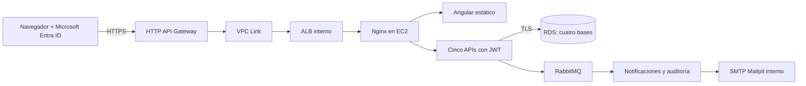

# EP3 desplegada en AWS

**Aplicación:** [abrir la web por HTTPS](https://6yyp6d2s6j.execute-api.us-east-1.amazonaws.com).

La entrega pública del 8 de octubre de 2026 ejecuta Angular, los cinco microservicios, RabbitMQ y Mailpit en EC2; las cuatro bases están en RDS PostgreSQL. El navegador inicia sesión con Microsoft Entra ID del tenant institucional configurado. No requiere ejecutar Docker ni Angular en el equipo del evaluador.

## Infraestructura



| Recurso | Configuración |
|---|---|
| Región | `us-east-1` |
| HTTP API | `ep3-reservas-web`, ID `6yyp6d2s6j`, stage `$default` |
| EC2 | `ep3-reservas-web`, `i-02e003bf20582716c`, Ubuntu 24.04, `t3.medium` |
| Disco EC2 | 20 GiB gp3 cifrados; IMDSv2 obligatorio |
| Balanceador | `ep3-reservas-alb`, interno, health check `/healthz` |
| VPC Link | `ep3-reservas-link`, ID `j2c9xi` |
| RDS | `ep3-reservas-postgres`, PostgreSQL 18.3, `db.t3.micro` |
| Contenedores | Nginx, cinco APIs Java 21, RabbitMQ y Mailpit |

El tráfico de entrada sigue los security groups VPC Link → ALB → EC2. EC2 acepta SSH únicamente desde la IPv4 de administración `/32`. RDS permite PostgreSQL desde el security group de EC2 y conserva la regla `/32` usada para comprobar SQL desde el equipo de desarrollo. Los puertos Java, AMQP, RabbitMQ Management, SMTP y Mailpit no se publican en Internet. La administración de RabbitMQ se realiza desde Angular con JWT.

## Acceso y demostración

1. Abrir la URL pública e iniciar sesión con una cuenta del directorio Microsoft configurado. Una cuenta de otro tenant no está habilitada por esta configuración.
2. Entrar a **Reservas**, completar cliente, email, fecha futura, horario y cantidad de personas entre 1 y 8.
3. Comprobar `CONFIRMADA` y `PUBLICADA`, la mesa asignada en **Disponibilidad** y el mismo evento en **Notificaciones** y **Auditoría**.
4. En **Admin RabbitMQ**, usar recursos de prueba `ep3.demo.*` para demostrar colas, exchanges y bindings. Conservar los recursos de negocio.

Mailpit recibe y conserva los correos de demostración dentro de AWS. Se comprueba el envío SMTP, pero no se entregan mensajes a buzones externos. Su interfaz y RabbitMQ Management permanecen internos; la inspección desde el equipo de desarrollo requiere acceso SSH.

Las APIs tienen prefijos `/backend/reservas`, `/backend/disponibilidad`, `/backend/notificaciones`, `/backend/auditoria` y `/backend/admin`. Por ejemplo:

- [Salud de reservas](https://6yyp6d2s6j.execute-api.us-east-1.amazonaws.com/backend/reservas/actuator/health).
- `GET /backend/reservas/reservas` requiere bearer; sin JWT devuelve `401`.

## Reproducir el despliegue

Requisitos: las dos ramas `feature/ep3-rubrica` en carpetas hermanas, Node.js/npm, Java 21/Maven, Python, OpenSSH, Azure CLI, `uv`/AWS CLI y sesiones cloud válidas. RDS y sus cuatro bases deben estar inicializadas siguiendo [EP3](EP3.md). El `.env` local contiene las URLs JDBC TLS y los valores Azure; nunca se publica.

Desde el backend:

```powershell
mvn package
python scripts/provisionar-publico.py --region us-east-1 --profile default
$estadoEp3 = Get-Content "$env:USERPROFILE\.codex\tmp\ep3-publico\infra.json" -Raw | ConvertFrom-Json
.\scripts\configurar-azure.ps1 -RedirectUri $estadoEp3.PublicUrl
python scripts/desplegar-publico.py
```

El provisionador reutiliza los recursos de esta demo y crea los que faltan mediante AWS CLI. El estado, la clave SSH y los archivos privados quedan en `~/.codex/tmp/ep3-publico`, fuera de Git. La cuenta necesita permisos para EC2, grupos de seguridad, ALB y HTTP API; también debe existir el rol de servicio `AWSServiceRoleForElasticLoadBalancing`. En este laboratorio se creó mediante `aws iam create-service-linked-role --aws-service-name elasticloadbalancing.amazonaws.com`.

El script Azure agrega el redirect HTTPS conservando los redirects previos de la SPA. El desplegador genera `environment.prod.ts`, compila Angular y transfiere por SCP los archivos estáticos, JAR y configuración Docker a `/home/ubuntu/ep3`. Los secretos viajan en un archivo separado con permisos `600`; EC2 no almacena credenciales AWS de despliegue. Las APIs usan un usuario RabbitMQ con contraseña aleatoria distinta de la demostración local.

Para esta máquina, donde el launcher de AWS CLI no funciona, el provisionador usa `uv tool run --from awscli python -m awscli`. Se verifican los certificados TLS; si la red institucional intercepta TLS, configurar `AWS_CA_BUNDLE` y `REQUESTS_CA_BUNDLE` con su CA de confianza, sin desactivar la validación.

## Evidencias y operación

La reserva pública `fd2f7e70-fd85-48ec-a911-14c035a9e952` se creó desde Angular servido por AWS, quedó confirmada y publicada y se comprobó en las cuatro bases. Los resultados están en `evidencias/ep3/postgres-aws-publico.json`, `aws-publico.json`, `aws-publico-interfaz.txt`, `aws-publico-logs.txt` y `reserva-aws-publica.png`. También se creó la cola `ep3.demo.aws-publico` desde Angular con JWT (`admin-aws-publico.png`); su limpieza interna exigió que estuviera vacía y sin consumidores. Las evidencias anteriores conservan las comprobaciones de DLQ, consumidores detenidos, CRUD administrador y persistencia.

```powershell
uv run --with 'psycopg[binary]' python scripts/verificar-postgres.py --reserva-id fd2f7e70-fd85-48ec-a911-14c035a9e952 --archivo-evidencia postgres-aws-publico.json
```

Los contenedores tienen `restart: unless-stopped` y Docker inicia con EC2. Antes de presentar, iniciar el laboratorio, comprobar que EC2 esté en ejecución y RDS disponible, verificar las cinco rutas `/actuator/health` e iniciar sesión. La URL depende de que los recursos permanezcan activos y no sean eliminados por el laboratorio. Si cambia la IP de administración o se detiene EC2, actualizar el estado con el provisionador antes de volver a desplegar.

EC2, ALB, RDS, almacenamiento y tráfico consumen créditos del laboratorio mientras correspondan. El despliegue usa una EC2 y RDS de una zona; conserva los límites académicos descritos en [EP3](EP3.md). El envío formal de enlaces en AVA y al docente se detalla en [ENTREGA_EP3](ENTREGA_EP3.md).

Referencias: [integraciones privadas HTTP API](https://docs.aws.amazon.com/apigateway/latest/developerguide/http-api-develop-integrations-private.html) y [VPC Links V2](https://docs.aws.amazon.com/apigateway/latest/developerguide/apigateway-vpc-links-v2.html).
