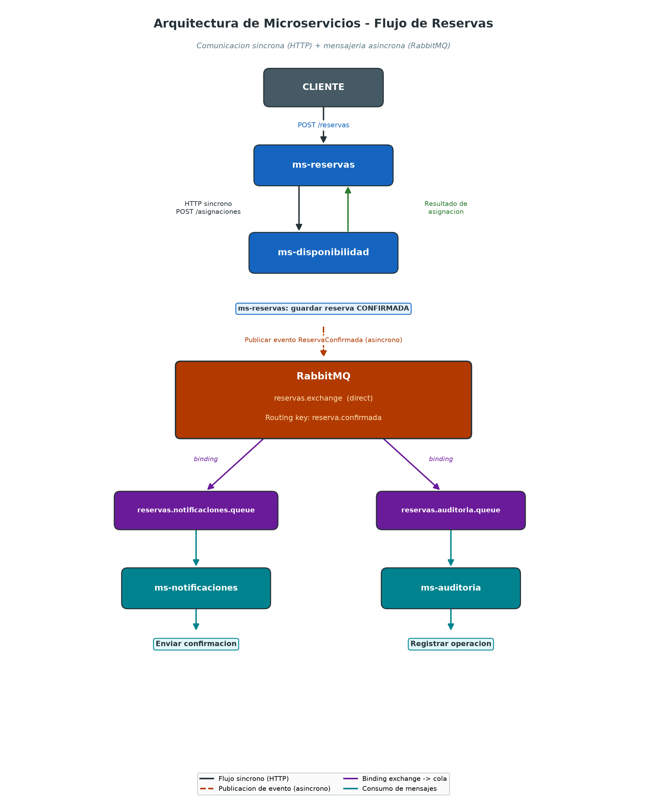

# Diseño de un sistema de reservas de mesas

**Parte 1 de la actividad evaluada con RabbitMQ**  
**Asignatura:** Desarrollo Cloud Native I  
**Ponderación:** 10% de la Evaluación Parcial 2  
**Fecha de entrega:** 2 de octubre de 2026  
**Integrantes:** Franco Garay, Deymon Gonzalez, Fernando Camus y Juan Carlos Tapia  
**Sección:** 002D

---

## 1. Problema y contexto

Un restaurante necesita gestionar reservas según la fecha, el horario y la cantidad de personas. El sistema debe verificar la disponibilidad antes de confirmar una reserva y evitar asignar una misma mesa a dos clientes en horarios coincidentes.

Proponemos resolver la asignación de mesas mediante comunicación síncrona y ejecutar el envío de confirmaciones y el registro de auditoría mediante RabbitMQ. Estas dos tareas pueden procesarse después sin bloquear la respuesta principal al cliente.

---

## 2. Objetivo

Diseñar una solución basada en microservicios que permita crear reservas, verificar y asignar mesas de forma inmediata y distribuir un evento de reserva confirmada a dos consumidores independientes.

---

## 3. Microservicios y responsabilidades

| Microservicio         | Responsabilidad                                                                      |
| :-------------------- | :----------------------------------------------------------------------------------- |
| **ms-reservas**       | Recibir solicitudes, coordinar la creación, guardar la reserva y publicar el evento. |
| **ms-disponibilidad** | Administrar mesas y horarios; verificar y asignar una mesa disponible.               |
| **ms-notificaciones** | Consumir eventos y enviar la confirmación al correo del cliente.                     |
| **ms-auditoria**      | Consumir eventos y guardar un registro de la operación.                              |

Cada microservicio administra sus propios datos. RabbitMQ transporta los eventos desde el producer hacia las colas de los consumidores.

---

## 4. Flujo principal

1. El cliente solicita una reserva mediante `POST /reservas` e indica su correo, fecha, horario y cantidad de personas.
2. `ms-reservas` valida los campos y genera un identificador de reserva.
3. `ms-reservas` llama por HTTP a `ms-disponibilidad` para verificar y asignar una mesa.
4. `ms-disponibilidad` comprueba capacidad y horario. La comprobación y la asignación se realizan de manera atómica para impedir asignaciones concurrentes sobre la misma mesa.
5. Si no existe disponibilidad, `ms-reservas` responde `409 Conflict` y no publica un evento de confirmación.
6. Si la asignación fue aceptada, `ms-reservas` guarda la reserva con estado `CONFIRMADA`.
7. `ms-reservas` publica `ReservaConfirmada` en RabbitMQ y responde `201 Created` con el identificador de reserva, sin esperar el procesamiento de los consumidores.
8. RabbitMQ entrega una copia del evento a la cola de notificaciones y otra a la cola de auditoría.
9. `ms-notificaciones` envía la confirmación y `ms-auditoria` guarda el registro. Cada consumidor confirma su mensaje después de completar su tarea.

---

## 5. Comunicación síncrona

- **Origen:** `ms-reservas`
- **Destino:** `ms-disponibilidad`
- **Operación:** `POST /asignaciones`

La respuesta es necesaria para continuar: solo se puede confirmar la reserva cuando existe una mesa y su asignación fue aceptada. Si el servicio no responde, no se informa una reserva confirmada.

### Solicitud propuesta y respuesta exitosa

#### Solicitud

```json
{
  "reservaId": "res-001",
  "fecha": "2026-10-10",
  "horaInicio": "20:00",
  "horaFin": "21:30",
  "cantidadPersonas": 4
}
```

#### Respuesta

```json
{
  "asignacionId": "asg-001",
  "mesaId": "mesa-05",
  "estado": "ASIGNADA"
}
```

---

## 6. Comunicaciones asíncronas

Las dos comunicaciones se originan en el evento `ReservaConfirmada`, publicado por `ms-reservas` después de guardar la reserva.

| Consumer              | Acción y justificación                                                                                                 |
| :-------------------- | :--------------------------------------------------------------------------------------------------------------------- |
| **ms-notificaciones** | Enviar el correo. Su demora no determina si la mesa quedó reservada; puede procesarse después de responder al cliente. |
| **ms-auditoria**      | Registrar la operación. La trazabilidad puede procesarse posteriormente sin bloquear la confirmación.                  |

Si un consumidor está temporalmente detenido, su mensaje puede permanecer en su cola hasta que vuelva a procesarlo.

---

## 7. Evento y topología de RabbitMQ

- **Evento:** `ReservaConfirmada`
- **Producer:** `ms-reservas`
- **Exchange:** `reservas.exchange`
- **Tipo:** `direct`
- **Routing key:** `reserva.confirmada`

| Queue                           | Consumer            |
| :------------------------------ | :------------------ |
| `reservas.notificaciones.queue` | `ms-notificaciones` |
| `reservas.auditoria.queue`      | `ms-auditoria`      |

Ambas queues tienen un binding con `reservas.exchange` y la clave `reserva.confirmada`. El exchange direct enruta por coincidencia exacta: cada publicación entrega una copia a cada cola vinculada. Se usan dos colas para que cada responsabilidad reciba el evento de forma independiente.

Se proponen exchange y queues durables, mensajes persistentes y confirmación manual del consumidor después del procesamiento.

---

## 8. Payload mínimo del evento

```json
{
  "eventoId": "evt-001",
  "tipoEvento": "ReservaConfirmada",
  "fechaEvento": "2026-10-02T18:30:00Z",
  "reservaId": "res-001",
  "clienteId": "cli-010",
  "emailCliente": "cliente@example.com",
  "mesaId": "mesa-05",
  "fechaReserva": "2026-10-10",
  "horaInicio": "20:00",
  "horaFin": "21:30",
  "cantidadPersonas": 4,
  "estado": "CONFIRMADA"
}
```

`eventoId` distingue el mensaje; `reservaId` relaciona la notificación y la auditoría con la operación. Los demás datos permiten procesar el evento sin consultar nuevamente a `ms-reservas`.

---

## 9. Diagrama de arquitectura



---

## 10. Conclusión

La disponibilidad y la asignación deben resolverse inmediatamente porque determinan si una reserva puede confirmarse. El correo y la auditoría pueden ejecutarse después mediante dos consumidores independientes. El diseño cumple una comunicación síncrona y dos asíncronas, con producer, exchange, queues, routing key y bindings definidos.
