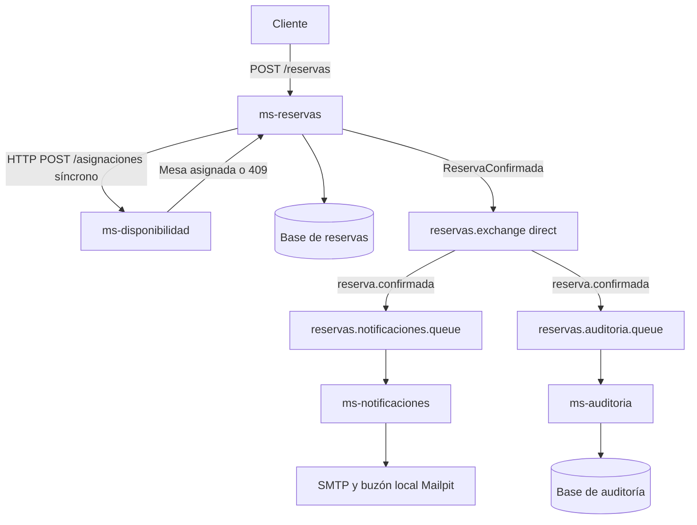

# Informe de implementación del sistema de reservas de mesas

> Informe histórico de la demostración del 5 de octubre de 2026. El código evolucionó a JPA, JWT, DLQ y cinco microservicios. Para la Evaluación Parcial 3 y las evidencias actuales, consultar [EP3](EP3.md).

**Asignatura:** Desarrollo Cloud Native I  
**Actividad:** Comunicación síncrona y asíncrona con RabbitMQ  
**Parte 2:** Implementación  
**Fecha:** 5 de octubre de 2026  
**Integrantes:** Franco Garay, Deymon Gonzalez, Fernando Camus y Juan Carlos Tapia  
**Sección:** 002D

El [informe original de diseño](INFORME_DISENO.md) contiene la Parte 1. Este documento lo complementa con la implementación y sus evidencias.

## Problema y diseño

Un restaurante necesita crear reservas sin asignar una misma mesa a clientes con horarios coincidentes. Antes de confirmar una reserva debe comprobar disponibilidad y asignar la mesa. Después debe enviar una confirmación y registrar auditoría.

El diseño utiliza cuatro microservicios. `ms-reservas` recibe y guarda la solicitud; `ms-disponibilidad` administra mesas y asignaciones; `ms-notificaciones` envía correos; `ms-auditoria` registra la operación. Cada servicio tiene una base H2 separada y persistente dentro de su volumen Docker.

La comunicación de reservas hacia disponibilidad es síncrona mediante HTTP `POST /asignaciones`, porque su respuesta determina si la reserva puede confirmarse. El envío de correo y la auditoría son asíncronos: ocurren después de la confirmación y no bloquean la respuesta al cliente.

El producer es `ms-reservas`. Publica `ReservaConfirmada` en el exchange durable `reservas.exchange`, de tipo `direct`, con routing key `reserva.confirmada`. Las colas durables `reservas.notificaciones.queue` y `reservas.auditoria.queue` tienen bindings con esa misma clave. Cada cola recibe su copia y tiene un consumidor con una responsabilidad diferente.

## Arquitectura



## Tecnologías y ejecución

Se implementó con Java 21, Spring Boot 3.5.7, Spring AMQP, JDBC, H2 y Docker Compose. RabbitMQ 4.1.4 incluye Management. Mailpit recibe correos por SMTP y permite verlos en un buzón local. Esta prueba no envía correos a destinatarios externos.

El comando `docker compose up -d --build` compila y levanta los seis contenedores: los cuatro microservicios, RabbitMQ y Mailpit. Las instrucciones y los endpoints están en [README](../README.md).

## Recorrido de una reserva

1. El cliente envía fecha, horario, cantidad de personas y correo a `POST /reservas`.
2. `ms-reservas` valida los datos y llama síncronamente a `ms-disponibilidad`.
3. La disponibilidad comprueba solapamientos y asigna una mesa. El bloqueo se mantiene hasta el commit para evitar asignaciones concurrentes dentro de esta instancia.
4. `ms-reservas` guarda el estado `CONFIRMADA` y el payload del evento. Publica un mensaje JSON persistente y espera la confirmación del broker.
5. Responde `201 Created` sin esperar a los consumidores. Informa `publicacion: PUBLICADA` cuando el broker confirma; si la publicación falla, conserva la reserva y devuelve `PENDIENTE`.
6. RabbitMQ dirige el evento hacia las dos colas.
7. Cada consumidor ejecuta su caso de uso y realiza `basicAck` después del procesamiento.

## Payload observado en la ejecución

El siguiente contenido proviene de la reserva real usada para verificar la implementación. `publicacion` es un dato de la respuesta HTTP y no pertenece al evento.

```json
{
  "eventoId": "55ca506e-d87a-4373-8532-de74ee73e690",
  "tipoEvento": "ReservaConfirmada",
  "fechaEvento": "2026-10-05T18:22:43.891692279Z",
  "reservaId": "051cc007-7a5f-447f-b2ed-d05740ee32c4",
  "clienteId": "demo-f7e46533-cd94-49ac-b8c8-ba6f2715b814",
  "emailCliente": "cliente@example.com",
  "mesaId": "mesa-05",
  "fechaReserva": "2026-11-04",
  "horaInicio": "18:00:00",
  "horaFin": "20:00:00",
  "cantidadPersonas": 8,
  "estado": "CONFIRMADA"
}
```

Los identificadores permiten relacionar el producer, las colas y ambos consumidores. Los datos de la reserva permiten procesar el evento sin volver a consultar al servicio principal.

## Fragmentos relevantes del código

La topología se define en `contratos/src/main/java/cl/reservas/contratos/RabbitTopology.java`:

```java
var exchange = new DirectExchange(EXCHANGE, true, false);
var notificaciones = new Queue(NOTIFICACIONES, true);
var auditoria = new Queue(AUDITORIA, true);
BindingBuilder.bind(notificaciones).to(exchange).with(ROUTING_KEY);
BindingBuilder.bind(auditoria).to(exchange).with(ROUTING_KEY);
```

El producer está separado del caso de uso en `ReservaPublisher.java`:

```java
properties.setContentType(MessageProperties.CONTENT_TYPE_JSON);
properties.setDeliveryMode(MessageDeliveryMode.PERSISTENT);
rabbit.send(RabbitTopology.EXCHANGE, RabbitTopology.ROUTING_KEY,
    new Message(mapper.writeValueAsBytes(evento), properties), correlacion);
var confirmacion = correlacion.getFuture().get(5, TimeUnit.SECONDS);
```

La infraestructura del consumer delega el procesamiento al servicio de aplicación. Después confirma el mensaje:

```java
// Cada microservicio tiene su propio listener y su propia cola.
service.procesar(evento, payload);
canal.basicAck(tag, false);
```

`NotificacionService` utiliza `JavaMailSender`; `AuditoriaService` guarda el registro mediante JDBC. Los listeners no contienen la lógica principal de correo o auditoría.

## Resultados verificados

Las pruebas del sistema se ejecutaron contra los contenedores reales mediante `scripts/verificar.py`. Resultado: **OK**. La hora exacta en UTC está en [resultado.json](../evidencias/resultado.json).

| Prueba | Resultado observado | Evidencia |
|---|---|---|
| Reserva con ambos consumers detenidos | HTTP 201 y publicación confirmada | `01-reserva-creada.json` |
| Enrutamiento a dos colas | Mensajes Ready en ambas colas y cero consumers | `02-queues-pendientes.json` |
| Notificación | Mismo evento registrado como correo enviado | `03-notificacion.json` |
| Auditoría | Mismo evento registrado en su base | `04-auditoria.json` |
| SMTP | Correo recibido en Mailpit | `05-correo-mailpit.json` |
| Mesa ocupada | HTTP 409 | `06-conflicto.json` |
| Concurrencia | Ocho solicitudes y una sola aceptada | `07-concurrencia.json` |
| Exchange y bindings | Direct durable y dos bindings con la misma clave | `08-exchange.json` y `09-bindings.json` |
| Consumers reiniciados | Colas procesadas y consumidores conectados | `10-queues-consumidas.json` |
| Producer y consumers | Logs con los identificadores de la reserva | `11-logs.txt` |
| Pruebas Java | Ocho pruebas, cero fallos y cero errores | `12-tests-java.txt` |

También se comprobó que un correo inválido, una fecha pasada, una cantidad de personas inválida y un intervalo invertido producen `400 Bad Request`.

**Reserva observada:** `051cc007-7a5f-447f-b2ed-d05740ee32c4`  
**Evento observado:** `55ca506e-d87a-4373-8532-de74ee73e690`

Las evidencias de RabbitMQ se obtuvieron mediante la API de Management. Las capturas de su interfaz gráfica se pueden añadir siguiendo [CAPTURAS](CAPTURAS.md); los archivos JSON no se presentan como capturas de pantalla.

## Alcance y limitaciones

La demo ejecuta una instancia por microservicio. El bloqueo de disponibilidad protege la asignación dentro de esa instancia; no se plantea escalado horizontal. Si falla el guardado, se intenta liberar la mesa. Si esa compensación también falla, el log indica la necesidad de revisión manual.

Si se guarda una reserva y falla la publicación, el evento permanece pendiente en la base y puede publicarse mediante `POST /reservas/{id}/publicar`. No hay un despachador automático de outbox ni atomicidad entre la base y RabbitMQ. Los consumidores detectan eventos ya registrados, pero no se garantiza envío SMTP exactamente una vez.

Los errores del consumidor se registran y rechazan sin reencolar; sin DLQ, esos mensajes se descartan. No se implementaron clustering, retries complejos ni autenticación de las APIs. Estas limitaciones y las instrucciones de recuperación están detalladas en el README.

## Conclusión

La implementación demuestra la llamada síncrona requerida para decidir la reserva y dos procesamientos asíncronos independientes. Se confirmó que la operación responde aun con ambos consumidores detenidos, que RabbitMQ conserva una copia en cada cola y que el correo y la auditoría se procesan al reiniciar los consumidores. Los identificadores compartidos y las evidencias permiten seguir el recorrido del mensaje.
